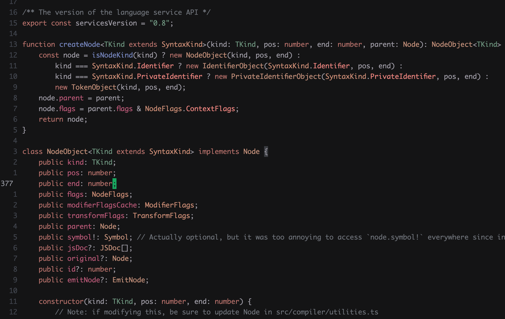

# WebStorm New UI Theme meets OldTale

This theme blends the WebStorm New Dark UI look with the OldTale color palette. It’s inspired by the [WebStorm New Dark UI](https://www.jetbrains.com/help/webstorm/new-ui.html) and [Old Tale](https://github.com/topazape/oldtale.nvim) themes and brings elements of both into one.

If you love the WebStorm feel in VS Code, you might also like [eenaree/webstorm-new-ui-theme](https://github.com/eenaree/webstorm-new-ui-theme). It helped inspire this project.

## Preview



### WebStorm New UI Theme meets OldTale

## Installation

1. Open **Extensions** in VS Code's sidebar. (or from Command Palette (**Ctrl+Shift+P**), run `View: Show Extensions`)
2. Search for `WebStorm New UI Theme meets OldTale`.
3. Click **Install** to install it.
4. From Command Palette (**Ctrl+Shift+P**), run `Preferences: Color Theme` and pick the theme you want.
   - `WebStorm New Dark meets OldTale`

## Supported Languages

- TypeScript
- TSX
- HTML
- CSS, SCSS
- Markdown
- JSON

## Recommended Editor Settings

```json
{
  "editor.fontFamily": "Ayuthaya",
  "editor.fontSize": 14,
  "editor.lineHeight": 1.6,
  "editor.inlayHints.padding": true,
  "editor.bracketPairColorization.enabled": false,
  "color-highlight.markRuler": false
}
```
