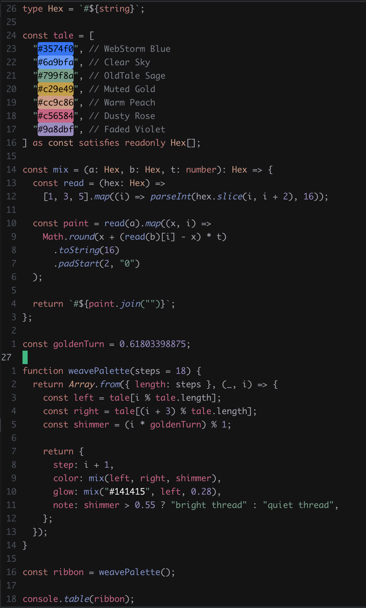

# WebStorm OldTale Dark

WebStorm OldTale Dark is a dark VS Code theme with WebStorm New UI chrome and OldTale-inspired editor colors. It is inspired by the [WebStorm New Dark UI](https://www.jetbrains.com/help/webstorm/new-ui.html) and [Old Tale](https://github.com/topazape/oldtale.nvim) themes.

If you love the WebStorm feel in VS Code, you might also like [eenaree/webstorm-new-ui-theme](https://github.com/eenaree/webstorm-new-ui-theme). It helped inspire this project.

## Preview



### WebStorm OldTale Dark

## Color Palette

| Role | Color | Hex |
| --- | --- | --- |
| Editor background | Deep Ink | `#141415` |
| Workbench base | Jet Panel | `#1e1f22` |
| Raised surface | Graphite | `#2b2d30` |
| Border and guides | Ash Line | `#42454a` |
| Primary text | Soft White | `#dfe1e5` |
| Muted text | Quiet Gray | `#9ea0a8` |
| Action blue | WebStorm Blue | `#3574f0` |
| Info blue | Clear Sky | `#6a9bfa` |
| Success green | OldTale Sage | `#799f8a` |
| Warning gold | Muted Gold | `#c29e49` |
| Error red | Signal Rose | `#d64d5b` |
| String peach | Warm Peach | `#cc9c86` |
| Keyword rose | Dusty Rose | `#c56584` |
| Type violet | Faded Violet | `#9a8dbf` |
| Symbol blue | Slate Blue | `#8292c7` |

## Installation

1. Open **Extensions** in VS Code's sidebar. (or from Command Palette (**Ctrl+Shift+P**), run `View: Show Extensions`)
2. Search for `WebStorm OldTale Dark`.
3. Click **Install** to install it.
4. From Command Palette (**Ctrl+Shift+P**), run `Preferences: Color Theme` and pick the theme you want.
   - `WebStorm OldTale Dark`

## Supported Languages

- TypeScript
- TSX
- HTML
- CSS, SCSS
- Markdown
- JSON

## Recommended Editor Settings

```json
{
  "editor.fontFamily": "Ayuthaya",
  "editor.fontSize": 14,
  "editor.lineHeight": 1.6,
  "editor.inlayHints.padding": true,
  "editor.bracketPairColorization.enabled": false,
  "color-highlight.markRuler": false
}
```
